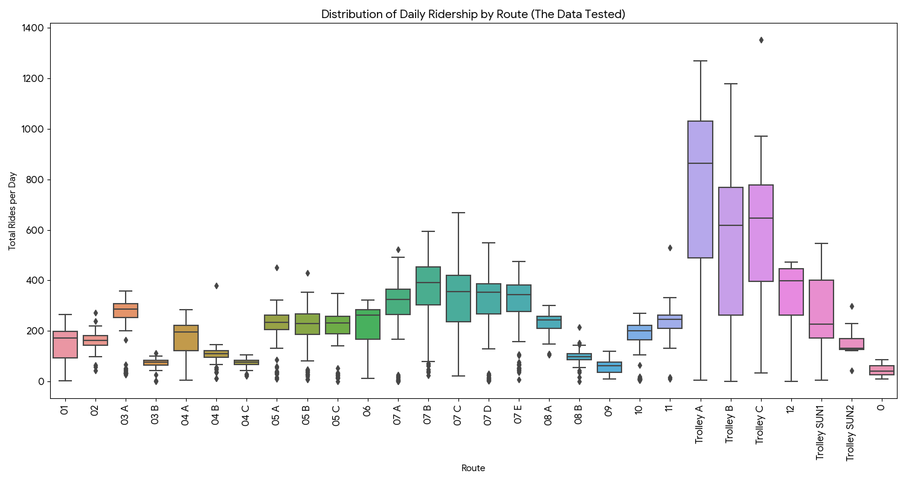

# Charlottesville Bus System
This research investigates the difference in bus ridership between UVA-affiliated and non-UVA-affiliated buses in Charlottesville using data from the City of Charlottesville Open Data portal. Two key questions are addressed: **What is the busiest hour for each group**, and **what are the busiest areas**.

## Data Sources
- [City of Charlottesville Open Data Portal](https://opendata.charlottesville.org/search?q=transit)

## Methodology
1. Data Collection: Ridership data for UVA-affiliated and non-UVA-affiliated buses were collected from the City of Charlottesville Open Data portal.
2. Data Cleaning: The datasets were cleaned to remove any inconsistencies or missing values.
3. Data Analysis: Statistical analysis was performed to compare ridership patterns between the two groups.
4. Visualization: Graphs and charts were created to visualize the findings.
5. Hypothesis Testing: ANOVA and T-Tests were conducted to determine the significance of differences in ridership.

